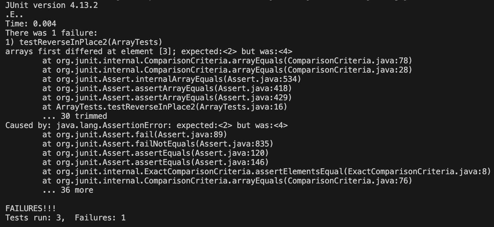

# Lab Report 3
## Part 1 - Bugs
---
---
> A failure-inducing input
```
@Test 
public void testReverseInPlace2() {
    int[] input2 = { 1, 2, 3, 4, 5 };
    ArrayExamples.reverseInPlace(input2);
    assertArrayEquals(new int[]{ 5, 4, 3, 2, 1 }, input2);
}
```
- Test with input of `{1, 2, 3, 4, 5}` produced a failure.

> An input that doesn't induce a failure
```
@Test 
public void testReverseInPlace() {
    int[] input1 = { 3 };
    ArrayExamples.reverseInPlace(input1);
    assertArrayEquals(new int[]{ 3 }, input1);
}
```
- Test with input of `{3}` did not induce a failure.

> The Symptom as the output of running the tests



> The bug, as the before-and-after code

```
public class ArrayExamples {

   // Changes the input array to be in reversed order
   static void reverseInPlace(int[] arr) {
    for(int i = 0; i < arr.length; i += 1) {
      arr[i] = arr[arr.length - i - 1];
    }
  }

  // Returns a *new* array with all the elements of the input array in reversed
  // order
  static int[] reversed(int[] arr) {
    int[] newArray = new int[arr.length];
    for(int i = 0; i < arr.length; i += 1) {
      arr[i] = newArray[arr.length - i - 1];
    }
    return arr;
  }

  // Averages the numbers in the array (takes the mean), but leaves out the
  // lowest number when calculating. Returns 0 if there are no elements or just
  // 1 element in the array
  static double averageWithoutLowest(double[] arr) {
    if(arr.length < 2) { return 0.0; }
    double lowest = arr[0];
    for(double num: arr) {
      if(num < lowest) { lowest = num; }
    }
    double sum = 0;
    for(double num: arr) {
      if(num != lowest) { sum += num; }
    }
    return sum / (arr.length - 1);
  }


}
```

- Above is the before code.
- Below is the after code.

```
public class ArrayExamples {

  // Changes the input array to be in reversed order
  static void reverseInPlace(int[] arr) {
    for(int i = 0; i < arr.length / 2; i += 1) {
      arr[i] = arr[arr.length - i - 1];
    }
  }

  // Returns a *new* array with all the elements of the input array in reversed
  // order
  static int[] reversed(int[] arr) {
    int[] newArray = new int[arr.length];
    for(int i = 0; i < arr.length / 2; i += 1) {
      int temp = arr[i];
      arr[i] = newArray[arr.length - i - 1];
      newArray[arr.length - i - 1] = temp;
    }
    return arr;
  }
  
  // Averages the numbers in the array (takes the mean), but leaves out the
  // lowest number when calculating. Returns 0 if there are no elements or just
  // 1 element in the array
  static double averageWithoutLowest(double[] arr) {
    if(arr.length < 2) { return 0.0; }
    double lowest = arr[0];
    for(double num: arr) {
      if(num < lowest) { lowest = num; }
    }
    double sum = 0;
    for(double num: arr) {
      if(num != lowest) { sum += num; }
    }
    return sum / (arr.length - 1);
  }


}
```
- This fix addresses the issue because it iterates up to `arr.length / 2` (half of the array). Then, it switches the element at `[0]` and the element at `[4]` and so forth. It will be reversed like the expected value of `{ 5, 4, 3, 2, 1 }` once there are no more elements to swap.

  
---
## Part 2 - Researching Commands
---
---
### Alternative ways to use the comman `find`:
> To find a single file by name, `-name` can be used in the form: `find /path/to/search -name ".txt"` [Source](https://www.redhat.com/sysadmin/linux-find-command)
  

**EXAMPLE 1**: `find ./technical -name "chapter-1.txt"`
- Output: `./technical/911report/chapter-1.txt`
- Reasoning: If the file exists, then the `find` command would return the path to the file. Else, it would not produce output.

**EXAMPLE 2**: `find ./technical -name "1468-6708-3-1.txt"`
- Output: `./technical/biomed/1468-6708-3-1.txt`
- Reasoning: Since the file exist, the `find` command returned the path to get to the file `"1468-6708-3-1.txt"`. Otherwise, it would not produce output if it did not exist in `./technical`

---

> To find files by a type, `-type` can be used in the form: `find /path/to/search -type f` [Source](https://www.redhat.com/sysadmin/linux-find-command)
  

**EXAMPLE 1**: `find ./technical -type d`
- Output:
-
```
./technical
./technical/government
./technical/government/About_LSC
./technical/government/Env_Prot_Agen
./technical/government/Alcohol_Problems
./technical/government/Gen_Account_Office
./technical/government/Post_Rate_Comm
./technical/government/Media
./technical/plos
./technical/biomed
./technical/911report
```

- Reasoning: The `find` command would list the path to all the directories and subdirectories in the `./techincal` directory.

 **EXAMPLE 2**: `find ./technical -type f`
 - Output: (Only snippet of output as output is large and repetive in terms of having simlar formatting of paths)
 - 
```
./technical/plos/journal.pbio.0020125.txt
./technical/plos/journal.pbio.0020440.txt
./technical/plos/pmed.0010062.txt
./technical/plos/pmed.0020189.txt
./technical/plos/pmed.0020162.txt
./technical/plos/pmed.0020016.txt
./technical/plos/pmed.0020002.txt
./technical/plos/pmed.0020200.txt
./technical/plos/pmed.0020231.txt
./technical/plos/journal.pbio.0020263.txt
./technical/plos/pmed.0020027.txt
./technical/plos/pmed.0020033.txt
./technical/plos/journal.pbio.0020101.txt
./technical/plos/pmed.0010047.txt
./technical/plos/journal.pbio.0030105.txt
./technical/plos/journal.pbio.0020302.txt
./technical/plos/pmed.0010046.txt
./technical/plos/pmed.0010052.txt
./technical/plos/pmed.0020191.txt
./technical/plos/journal.pbio.0020100.txt
./technical/plos/pmed.0020146.txt
./technical/plos/journal.pbio.0020262.txt
./technical/plos/journal.pbio.0030065.txt
./technical/plos/journal.pbio.0020276.txt
./technical/plos/pmed.0020232.txt
./technical/plos/pmed.0020226.txt
./technical/plos/pmed.0020024.txt
./technical/plos/pmed.0020018.txt
./technical/plos/pmed.0020144.txt
./technical/plos/pmed.0020150.txt
./technical/plos/journal.pbio.0020116.txt
./technical/plos/pmed.0020187.txt
./technical/plos/pmed.0010050.txt
./technical/plos/pmed.0010051.txt
./technical/plos/pmed.0020192.txt
./technical/plos/pmed.0010045.txt
./technical/plos/pmed.0020145.txt
./technical/plos/pmed.0020019.txt
./technical/plos/journal.pbio.0020063.txt
./technical/plos/journal.pbio.0030076.txt
./technical/plos/journal.pbio.0030062.txt
./technical/plos/pmed.0020237.txt
./technical/plos/journal.pbio.0020067.txt
./technical/plos/pmed.0020009.txt
./technical/plos/journal.pbio.0020073.txt
./technical/plos/pmed.0020035.txt
./technical/plos/pmed.0020021.txt
./technical/plos/journal.pbio.0020113.txt
./technical/plos/pmed.0020155.txt
./technical/plos/pmed.0010069.txt
./technical/plos/pmed.0010041.txt
./technical/plos/pmed.0020182.txt
./technical/plos/pmed.0020196.txt
./technical/plos/journal.pbio.0020311.txt
./technical/plos/journal.pbio.0030102.txt
./technical/plos/journal.pbio.0020310.txt
./technical/plos/pmed.0020197.txt
./technical/plos/pmed.0010068.txt
./technical/plos/pmed.0020140.txt
./technical/plos/journal.pbio.0020112.txt
./technical/plos/pmed.0020020.txt
./technical/plos/pmed.0020034.txt
./technical/plos/pmed.0020236.txt
./technical/plos/journal.pbio.0020272.txt
./technical/plos/pmed.0020208.txt
./technical/plos/journal.pbio.0020064.txt
./technical/biomed/1472-6793-2-19.txt
./technical/biomed/1471-230X-1-8.txt
./technical/biomed/1471-2148-2-7.txt
./technical/biomed/gb-2002-3-5-research0022.txt
./technical/biomed/1471-2288-3-9.txt
./technical/biomed/1471-2105-3-22.txt
./technical/biomed/1472-6947-2-4.txt
./technical/biomed/bcr317.txt
./technical/biomed/1475-925X-2-3.txt
./technical/biomed/bcr303.txt
./technical/biomed/1471-2105-3-23.txt
./technical/biomed/1471-2288-3-8.txt
./technical/biomed/bcr458.txt
./technical/biomed/1471-2105-3-37.txt
./technical/biomed/gb-2002-3-5-research0023.txt
./technical/biomed/1472-6793-2-18.txt
./technical/biomed/1471-2156-2-17.txt
./technical/biomed/1471-2369-4-1.txt
./technical/biomed/ar149.txt
./technical/biomed/gb-2002-3-6-research0029.txt
./technical/biomed/1471-2121-1-2.txt
./technical/biomed/1471-2180-1-34.txt
./technical/biomed/gb-2003-4-8-r50.txt
./technical/biomed/1471-2164-3-7.txt
./technical/biomed/1471-2164-3-30.txt
./technical/biomed/1471-2202-2-20.txt
./technical/biomed/1471-2164-3-24.txt
./technical/biomed/1471-2202-3-7.txt
./technical/biomed/1471-2091-3-16.txt
./technical/biomed/1471-2164-3-18.txt
./technical/biomed/1472-6750-3-6.txt
./technical/biomed/1472-6793-1-2.txt
./technical/biomed/1471-2334-2-6.txt
./technical/biomed/1471-213X-1-15.txt
./technical/biomed/cc350.txt
./technical/biomed/1471-2148-3-1.txt
./technical/biomed/bcr588.txt
./technical/biomed/1471-2199-2-2.txt
./technical/biomed/1475-2867-2-7.txt
./technical/biomed/1468-6708-3-4.txt
./technical/biomed/1471-2121-3-25.txt
./technical/biomed/1471-2334-3-12.txt
./technical/biomed/1471-2202-4-6.txt
./technical/biomed/1472-6882-1-10.txt
./technical/biomed/1471-2121-3-19.txt
./technical/biomed/1471-2164-4-6.txt
./technical/biomed/1471-2229-2-9.txt
./technical/biomed/gb-2002-3-9-research0049.txt
./technical/biomed/1471-2334-1-17.txt
./technical/biomed/1471-2180-2-1.txt
./technical/biomed/cc973.txt
./technical/biomed/1471-2210-1-7.txt
./technical/biomed/1471-2326-2-4.txt
./technical/biomed/1471-2180-2-16.txt
./technical/biomed/1471-2121-4-1.txt
./technical/biomed/1471-213X-2-8.txt
./technical/biomed/1472-6793-1-12.txt
./technical/biomed/1471-2199-4-4.txt
./technical/biomed/1471-2199-4-5.txt
./technical/biomed/1471-2369-3-1.txt
./technical/biomed/1471-2164-2-1.txt
./technical/biomed/1471-2202-2-1.txt
./technical/biomed/gb-2002-3-9-research0048.txt
./technical/biomed/1471-2229-2-8.txt
./technical/biomed/1471-2474-4-8.txt
./technical/biomed/1471-2121-3-18.txt
./technical/biomed/1472-6882-1-11.txt
./technical/biomed/1471-2334-3-13.txt
./technical/biomed/cvm-2-1-038.txt
./technical/biomed/1471-2121-3-30.txt
./technical/biomed/1471-2156-4-10.txt
./technical/biomed/1471-2199-2-3.txt
./technical/biomed/1476-4598-1-3.txt
./technical/biomed/1471-2172-2-10.txt
./technical/biomed/1471-2121-2-6.txt
./technical/biomed/1477-7827-1-21.txt
./technical/biomed/1477-7827-1-23.txt
./technical/biomed/1475-2891-1-2.txt
./technical/biomed/1468-6708-3-7.txt
./technical/biomed/1471-2199-2-1.txt
./technical/biomed/1471-2105-1-1.txt
./technical/biomed/gb-2002-3-10-research0052.txt
./technical/biomed/1471-2202-4-5.txt
./technical/biomed/1471-2334-3-11.txt
./technical/biomed/1471-2164-4-5.txt
./technical/biomed/cvm-2-6-278.txt
./technical/biomed/cvm-2-4-180.txt
./technical/biomed/1471-2105-3-3.txt
./technical/biomed/gb-2003-4-2-r9.txt
./technical/biomed/1475-2883-2-11.txt
./technical/biomed/1475-2867-2-10.txt
./technical/biomed/1471-2202-2-3.txt
./technical/biomed/bcr602.txt
./technical/biomed/1471-2180-2-2.txt
./technical/biomed/gb-2001-2-12-research0055.txt
./technical/biomed/1478-1336-1-4.txt
./technical/biomed/1472-6793-2-4.txt
./technical/biomed/1471-2210-1-4.txt
./technical/biomed/1471-2091-3-4.txt
./technical/biomed/1471-2121-4-2.txt
./technical/biomed/gb-2002-3-4-research0019.txt
./technical/biomed/1471-2202-3-10.txt
./technical/biomed/1471-2180-2-29.txt
./technical/biomed/1472-6750-2-2.txt
./technical/biomed/1476-511X-2-3.txt
./technical/biomed/cc1547.txt
./technical/biomed/1472-6793-1-11.txt
./technical/biomed/1471-2407-2-9.txt
./technical/biomed/1471-2407-2-8.txt
./technical/biomed/1476-4598-2-28.txt
./technical/biomed/1476-511X-2-2.txt
./technical/biomed/1471-2202-3-11.txt
./technical/biomed/1471-2121-4-3.txt
./technical/biomed/gb-2002-3-4-research0018.txt
./technical/biomed/1471-2261-2-11.txt
./technical/biomed/1472-6793-2-5.txt
./technical/biomed/1471-2164-2-2.txt
./technical/biomed/gb-2001-2-12-research0054.txt
./technical/biomed/ar104.txt
./technical/biomed/1471-2407-1-15.txt
./technical/biomed/1471-2202-2-2.txt
./technical/biomed/gb-2003-4-2-r8.txt
./technical/biomed/1472-6947-1-2.txt
./technical/biomed/1471-2105-3-2.txt
./technical/biomed/1471-2229-2-11.txt
./technical/biomed/1471-2164-4-4.txt
./technical/biomed/cvm-2-6-286.txt
./technical/biomed/1471-2148-1-1.txt
./technical/biomed/1471-2334-3-10.txt
./technical/biomed/1472-6882-1-12.txt
./technical/biomed/gb-2002-3-10-research0053.txt
./technical/biomed/1471-2156-2-8.txt
./technical/biomed/rr196.txt
./technical/biomed/1471-2148-3-3.txt
./technical/biomed/1472-6807-2-9.txt
./technical/biomed/1477-7827-1-36.txt
./technical/biomed/1471-2148-3-7.txt
./technical/biomed/1471-213X-1-13.txt
./technical/biomed/1471-2121-2-1.txt
./technical/biomed/gb-2002-3-3-research0012.txt
./technical/biomed/1471-2156-3-22.txt
./technical/biomed/bcr571.txt
./technical/biomed/1471-2199-2-4.txt
./technical/biomed/gb-2000-1-2-research0003.txt
./technical/biomed/1472-6955-2-1.txt
./technical/biomed/1471-2105-3-6.txt
./technical/biomed/1471-2474-3-23.txt
./technical/biomed/1472-6947-1-6.txt
./technical/biomed/1471-2407-3-14.txt
./technical/biomed/1471-2202-2-6.txt
./technical/biomed/1475-2867-2-15.txt
./technical/biomed/1472-6793-2-1.txt
./technical/biomed/gb-2002-3-8-research0039.txt
./technical/biomed/1471-2369-3-6.txt
./technical/biomed/bcr607.txt
./technical/biomed/1472-6874-2-8.txt
./technical/biomed/1471-2180-2-7.txt
./technical/biomed/1471-2164-2-6.txt
./technical/biomed/1471-2180-2-38.txt
./technical/biomed/1471-2210-3-3.txt
./technical/biomed/1471-2431-2-11.txt
./technical/biomed/1472-6793-1-15.txt
./technical/biomed/1471-2458-3-9.txt
./technical/biomed/1471-2121-4-6.txt
./technical/biomed/1471-2202-3-14.txt
./technical/biomed/1471-2164-2-7.txt
./technical/biomed/gb-2001-2-12-research0051.txt
./technical/biomed/gb-2002-3-8-research0038.txt
./technical/biomed/1471-244X-3-5.txt
./technical/biomed/1471-2202-2-7.txt
./technical/biomed/1471-2334-1-10.txt
./technical/biomed/1471-2407-3-15.txt
./technical/biomed/1471-2121-3-22.txt
./technical/biomed/1471-2334-3-15.txt
./technical/biomed/1471-2148-1-4.txt
./technical/biomed/1471-2199-2-5.txt
./technical/biomed/1468-6708-3-3.txt
./technical/biomed/bcr570.txt
./technical/biomed/gb-2002-3-10-research0056.txt
./technical/biomed/1472-6947-3-5.txt
./technical/biomed/cc343.txt
./technical/biomed/1471-213X-1-12.txt
./technical/biomed/1471-2296-3-3.txt
./technical/biomed/1477-7827-1-27.txt
./technical/biomed/1476-4598-1-5.txt
./technical/biomed/rr191.txt
./technical/biomed/1471-2148-3-4.txt
./technical/biomed/1471-2458-3-11.txt
./technical/biomed/1475-2875-1-5.txt
./technical/biomed/1477-7827-1-31.txt
./technical/biomed/1471-213X-1-10.txt
./technical/biomed/gb-2002-3-3-research0011.txt
./technical/biomed/gb-2002-3-10-research0054.txt
./technical/biomed/1468-6708-3-1.txt
./technical/biomed/1471-2148-1-6.txt
./technical/biomed/1471-2202-4-3.txt
./technical/biomed/1472-6947-1-5.txt
./technical/biomed/1471-2202-2-5.txt
./technical/biomed/1476-9433-1-2.txt
./technical/biomed/1471-2210-1-2.txt
./technical/biomed/1471-2458-1-9.txt
./technical/biomed/1472-6793-2-2.txt
./technical/biomed/gb-2001-2-12-research0053.txt
./technical/biomed/1478-1336-1-2.txt
./technical/biomed/1471-2202-3-16.txt
./technical/biomed/1471-2180-2-13.txt
./technical/biomed/1471-2121-4-4.txt
./technical/biomed/gb-2003-4-4-r28.txt
./technical/biomed/1471-230X-2-17.txt
./technical/biomed/1477-5956-1-1.txt
./technical/biomed/1471-2156-4-9.txt
./technical/biomed/1471-2431-2-12.txt
./technical/biomed/ar328.txt
./technical/biomed/1471-2210-3-1.txt
./technical/biomed/1471-2121-4-5.txt
./technical/biomed/1471-2350-2-8.txt
./technical/biomed/1471-2202-3-17.txt
./technical/biomed/1471-2407-1-13.txt
./technical/biomed/bcr605.txt
./technical/biomed/1476-069X-2-9.txt
./technical/biomed/1478-1336-1-3.txt
./technical/biomed/1471-2164-2-4.txt
./technical/biomed/1471-2210-1-3.txt
./technical/biomed/1476-9433-1-3.txt
./technical/biomed/1471-2334-1-13.txt
./technical/biomed/1471-2407-3-16.txt
./technical/biomed/1471-2164-4-2.txt
./technical/biomed/cvm-2-4-187.txt
./technical/biomed/1471-2105-3-4.txt
./technical/biomed/1471-2121-3-21.txt
./technical/biomed/1471-2202-4-2.txt
./technical/biomed/1471-2172-3-9.txt
./technical/biomed/gb-2001-2-3-research0007.txt
./technical/biomed/1471-2199-2-6.txt
./technical/biomed/bcr567.txt
./technical/biomed/gb-2002-3-10-research0055.txt
./technical/biomed/1471-2121-2-3.txt
./technical/biomed/1471-213X-1-11.txt
./technical/biomed/1472-684X-1-5.txt
./technical/biomed/1476-4598-1-6.txt
./technical/911report/chapter-13.4.txt
./technical/911report/chapter-13.5.txt
./technical/911report/chapter-13.1.txt
./technical/911report/chapter-13.2.txt
./technical/911report/chapter-13.3.txt
./technical/911report/chapter-3.txt
./technical/911report/chapter-2.txt
./technical/911report/chapter-1.txt
./technical/911report/chapter-5.txt
./technical/911report/chapter-6.txt
./technical/911report/chapter-7.txt
./technical/911report/chapter-9.txt
./technical/911report/chapter-8.txt
./technical/911report/preface.txt
./technical/911report/chapter-12.txt
./technical/911report/chapter-10.txt
./technical/911report/chapter-11.txt
```
- Reasoning: The `find` command would list the path to all the files in the `./techincal` directory since it was specified to `-type f`.

---

> To specify the max directory levels to look for, `-maxdepth level` can be used in the form: `find /path/to/search -maxdepth 6` [Source](https://www.redhat.com/sysadmin/linux-find-command)
- The search would search only up 6 levels.
  
 **EXAMPLE 1**: `find ./technical -maxdepth 1`
- Output:
```
./technical
./technical/government
./technical/plos
./technical/biomed
./technical/911report
```

- Reasoning: The `find` command would search up to the `maxdepth` of 1, which means it would only search up to the subdirectories in `./technical`.
  
 **EXAMPLE 2**: `find ./technical -maxdepth 2 -type d` (specifying `type d` in order to fit the whole output, otherwise it would have similar formatting with multiple files)
- Output:
```
./technical/government/About_LSC
./technical/government/Env_Prot_Agen
./technical/government/Alcohol_Problems
./technical/government/Gen_Account_Office
./technical/government/Post_Rate_Comm
./technical/government/Media
```
- Reasoning: The `find` command would search up to the `maxdepth` of 2. Specified to `type d`, it would search only up to the subdirectory `government` and the other directories within it.

---

> To find a file by an specified name and ignoring the case of letters, `-iname` can be used in the form: `find /path/to/search -iname "*filename*.txt"` [Source](https://www.redhat.com/sysadmin/linux-find-command)


**EXAMPLE 1**: `find ./technical -iname "*BILL*.txt"`
- Output: `./technical/government/Env_Prot_Agen/bill.txt`
- Reasoning: The `-iname` ignores the case of `BILL.txt`, searches the variation of `bill.txt`, and shows the path to the file.
  
**EXAMPLE 2**: `find ./technical -iname "*ChApter-7.tXt*"`
- Output: `./technical/911report/chapter-7.txt`
- Reasoning: The `-iname` ignores the case of `ChApter-7.tXt`, searches the variation of `chapter-7.txt`, and shows the path to the file.
  
---
