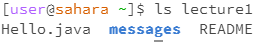

# Lab Report 1
## Example of using the command with no arguments: 

- The working directory was /home.
- Command produces no output.
- It is not an error as there is no directory to change to therefore, not having an effect.

- The working directory was /home.
- Command lists the files and folder in the path, in this case it is lecture1.
- It is not an error as it is a status-checking command that listed the files in the path.

- The working directory was /home.
- Command produces no output. Should print the contents of the files in path (there is no content to print in path to do this).
- It is an error as there is nothing to concatenate and thus, does not show any content.
  
## Exmaple of using the command with a path to a directory as an argument: 

- The working directory was /lecture1 that files were cloned into.
- Command produces no output.
- It is not an error as it simply changing the working directory to given path.
  
 
- The working directory was /home for the first screenshot while the second screenshot had /lecture1.
- Command produces a list of the files in lecture1 but the second screenshot (when adding a path) displays an error.
- It is not an error in the first screenshot but adding the path of lecture1 and trying to access home caused an error.
- It cannot access the directory as it does not exist in lecture1. It does however, exist in the first screenshot (home) thus displaying in the first screenshot.

## Example of using the command with a path to a file as an argument: 

- Working directory was lecture1.
- Shows the name of files and folder in the directory, lecture1.
- Command produced an output of "Hello.java messages README"
- It is not an error as it is a status-checking command.
- 

- The working directory was lecture1.
- Concatenates and prints content, given the path.
- Command produced an output of the contents in the file Hello.java.
- It is a not an error as all contents were printed in the file.
