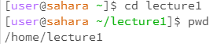
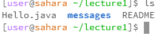
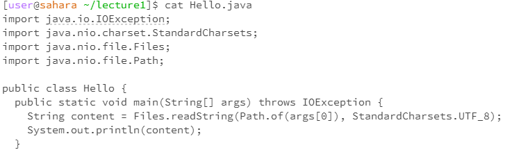

# Lab Report 1
**Example of using the command with no arguments:**

- The working directory was lecture1 that files were cloned into.
- Command produces no output.
- It is not an error as it simply changing the working directory.
  
__Exmaple of using the command with a path to a directory as an argument__

- Working directory was lecture1.
- Shows the name of files and folder in the directory, lecture1.
- Command produced an output of "Hello.java messages README"
- It is not an error as it is a status-checking command.

**Example of using the command with a path to a file as an argument**

- The working directory was lecture1.
- Concatinates
- Command produced an output of
- It is a not an error
