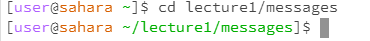

# Lab Report 1
## Example of using the command with no arguments: 

- The working directory was /home/lecture1.
- Command produces no output.
- It is not an error as it is simply changing the directory from /lecture1 to /home when using the command cd.

- The working directory was /home.
- Command lists the files and folder in the path, in this case it is lecture1.
- It is not an error as it is a status-checking command that listed the files in the path.

- The working directory was /home.
- Command produces no output. Should print the contents of the files in path (there is no content to print in path to do this).
- It is not an error as there is nothing to concatenate and thus, does not show any content.
  
## Exmaple of using the command with a path to a directory as an argument: 

- The working directory was /lecture1 that files were cloned into.
- Command produces no output.
- It is not an error as it simply changing the working directory to given path /messages.
  
 
- The working directory was /home.
- Command produces a list of the files in lecture1.
- It is not an error as there was access to the path of /home/lecture1 thus being able to output a list of all the files.

 
- The working directory was /home.
- Command produces a confirmation of how the path was a directory.
- It is not an error as there is nothing to concatenate or print and thus, does not print any content.
  
## Example of using the command with a path to a file as an argument: 

- Working directory was /home.
- Command produced no ouput. However, the directory changed to /lecture1/messages.
- It is not an error as it is changing the directory and ls or cat would be utilized to list or print contents.
  

- Working directory was /home.
- Shows the name of files and folder in the directory, lecture1.
- Command produced an output of "Hello.java messages README"
- It is not an error as it is a status-checking command.
  

- The working directory was /home.
- Concatenates and prints content, given the path.
- Command produced an output of the contents in the file Hello.java.
- It is a not an error as all contents were printed in the file.
