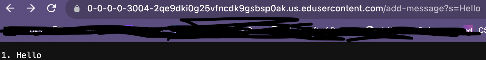
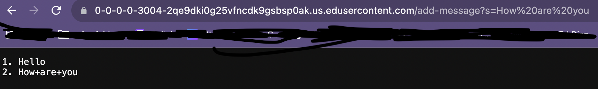

# Lab Report 2
> Part 1

StringServer.java Code
import java.io.IOException;
import java.net.URI;

class Handler implements URLHandler {
    int num = 0; //initialized at 0 (nothing in list yet)
    String text = new String(""); // new object
    public String handleRequest(URI url) {
        if (url.getPath().equals("/")) {
            return text;
        }
        else if (url.getPath().contains("/add-message")) {
            String[] parameters = url.getQuery().split("=");
            if (parameters[0].equals("s")) {
                num += 1; // increments line num
                return String.format(text+= "" + Integer.toString(num) + ". " + parameters[1] + "\n");
                }
            return "404 Not Found!";            
            }
            return "";
       }
}

class StringServer {
   StringServer() {
   }

   public static void main(String[] var0) throws IOException {
      if (var0.length == 0) {
         System.out.println("Missing port number! Try any number between 1024 to 49151");
      } else {
         int var1 = Integer.parseInt(var0[0]);
         Server.start(var1, new Handler());
      }
   }
}

>>/add-message?s=Hello(  ) 

- The working directory was /home/lecture1.
- Command produces no output.
- It is not an error as it is simply changing the directory from /lecture1 to /home when using the command cd.

>>/add-message?s=How are you

- The working directory was /home/lecture1.
- Command produces no output.
- It is not an error as it is simply changing the directory from /lecture1 to /home when using the command cd.

  
