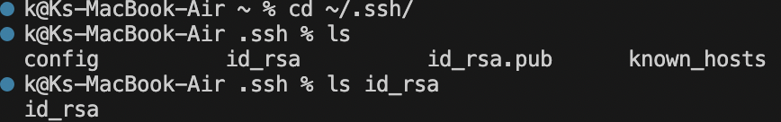
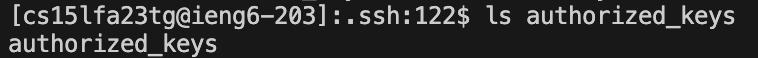
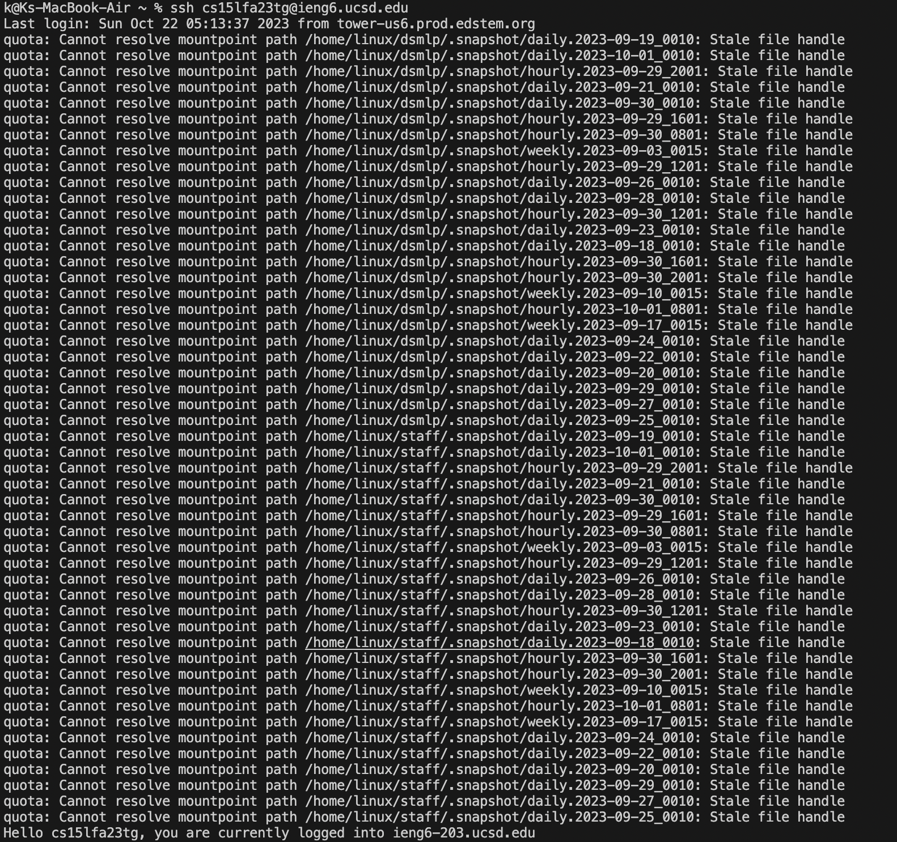

# Lab Report 2
# Part 1

### StringServer.java Code

`import java.io.IOException;`

`import java.net.URI;`

`class Handler implements URLHandler {`

    int num = 0; //initialized at 0 (nothing in list yet)
    String text = new String(""); // new object
    public String handleRequest(URI url) {
        if (url.getPath().equals("/")) {
            return text;
        }
        else if (url.getPath().contains("/add-message")) {
            String[] parameters = url.getQuery().split("=");
            if (parameters[0].equals("s")) {
                num += 1; // increments line num
                return String.format(text+= "" + Integer.toString(num) + ". " + parameters[1] + "\n");
                }
            return "404 Not Found!";            
            }
            return "";
       }
`}`

`class StringServer {`
  `StringServer() {`
  `}`
    `public static void main(String[] var0) throws IOException {`
   
      if (var0.length == 0) {
         System.out.println("Missing port number! Try any number between 1024 to 49151");
      } else {
         int var1 = Integer.parseInt(var0[0]);
         Server.start(var1, new Handler());
      }
  ` }`
   
`}`

---

### /add-message?s=Hello

- The `handleRequest()` method was called.
- The method accepts a URI object, called url in this case, as an argument with a return value of a String.
- Other values included are: int num, which increments per line and a String object called text.
- num is incremented by 1 (since this was the first request) while the object, text, is initialized to "Hello."

### /add-message?s=How are you

- Similar to the previous request, the handleRequest() method was called.
- The method accepts a URI object, called url in this case, as an argument with a return value of a String.
- Other values included are: int num, which increments per line and a String object called text.
- num is incremented by 2 (since this was the second request) while the object, text, is initialized to "How are you."

---

# Part 2
### Private key

  
### Public key 

  
### Terminal interaction without being asked for a password

---

# Part 3
- Something I learned from lab 3 was the scp command which can copy files or directories to two systems. I thought this was interesting as I have heard of the word scp but I never truly knew what it meant or how to use it. Combined with the man scp command, I was able to learn more about scp in the terminal itself also which I thought was interesting.
