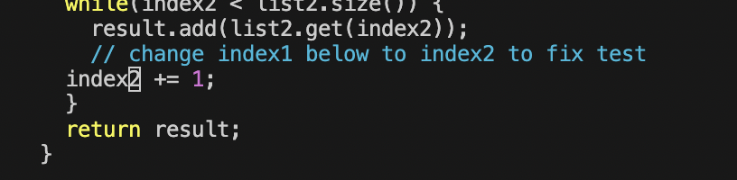

# Lab Report 4
## Log into ieng6
---
---

- Keys pressed: `Command-C`, `ssh cs15lfa23tg@ieng6.ucsd.edu`, `<enter>`
> Copy and pasted login. This logs into the ieng6 specific account.

---
## Clone your fork of the repository from your Github account (using the SSH URL)
---
---

- Keys pressed: `ssh-keygen`, `<enter><enter><enter><enter><enter>`
> This creates a public/private rsa key pair.
- Keys pressed: `cat /home/linux/ieng6/cs15lfa23/cs15lfa23tg/.ssh/id_rsa.pub`, `<enter>`
> This concatenates the path of the ssh key .pub file which would be used to generate a SSH key for the GitHub repository.
- Keys pressed: `ssh-keyscan -t rsa github.com >> ~/.ssh/known_hosts`, `<enter>`
> This will add Github.com as a recognized host and the `>>` would append stdout of the command to file. Thus, avoiding a yes/no prompt about accepting new connections (during first connection).
- Keys pressed: `ssh -T git@github.com`, `<enter>`
> Ensures connection and checks it. Outputs: "Hi kyavu! You've successfully authenticated, but GitHub does not provide shell access."

---
## Run the tests, demonstrating that they fail
---
---

- Keys pressed: `bash test.sh`, `<enter>`
> This will run the tests from `ListExamplesTest.java` and produces a failure output due to an error in `ListExamples.java`

---
## Edit the code file to fix the failing test
---
---

- Keys pressed: `vim ListExamples.java`, `<enter>`
> This will open the existing file of `ListExamples.java` with vim.
- Keys pressed: `:44`, `<enter>`, `e` `x` `i`, "2", `<esc>` `:wq`, `<enter>`
> `:44` will jump to line 44 in which the error with `index1` resides. `e` will then jump to the end of `index1` which `x` will delete the 1. After, `i` will enter insert mode and typing in "2" will make the edit of `index2`. In order to save the edits and exit, `<esc>` `:wq`, `<enter>` is used.

---
## Run the tests, demonstrating that they now succeed
---
---

- Keys pressed: `bash test.sh`, `<enter>`
> This will run the tests from `ListExamplesTest.java` and produces a success output as the error in `ListExamples.java` was fixed.
---
## Commit and push the resulting change to your Github account
---
---

