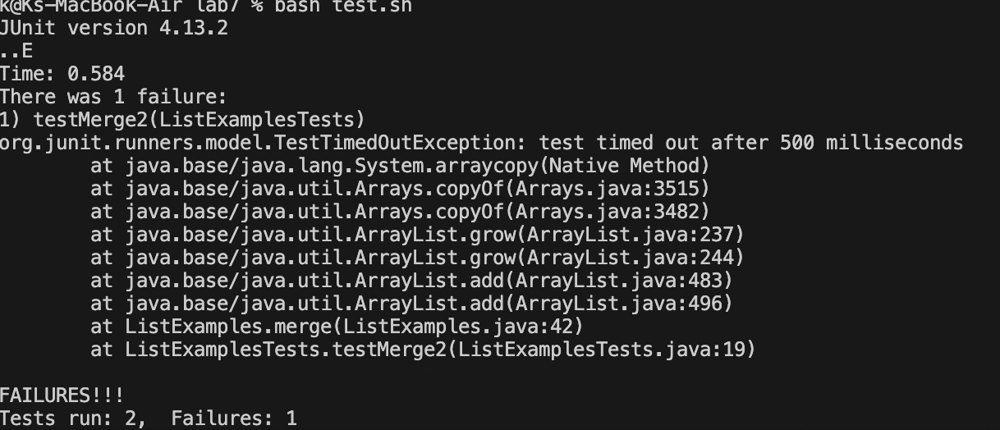
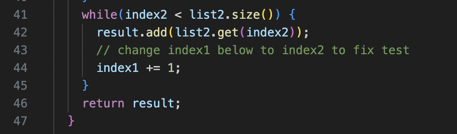
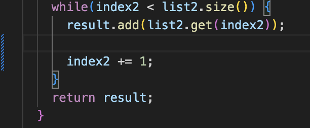
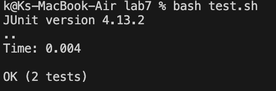

# Lab Report 5
## Part 1 - Debugging Scenario
---
---
> 1. Student Post

- Hello, I am having trouble with my tests as I'm getting failures. I've looked back on it but I'm not sure what the problem is. I know that it's around line 42 (as shown in the failure output), but I'm not sure which part of it is wrong.
  
> 2. TA Response
- Hi, looking at the reason the test failed, take a look at line 44. Why would this test time out?
  
> 3. Student Try

- Hello, I realized my mistake! Taking your feedback, I realized I needed to change the `index1` to `index2`. Thank you.

> 4. Setup
- The file and directory structure needed
- 
---
## Clone your fork of the repository from your Github account (using the SSH URL)
---
---
