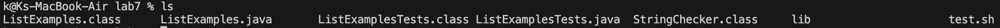
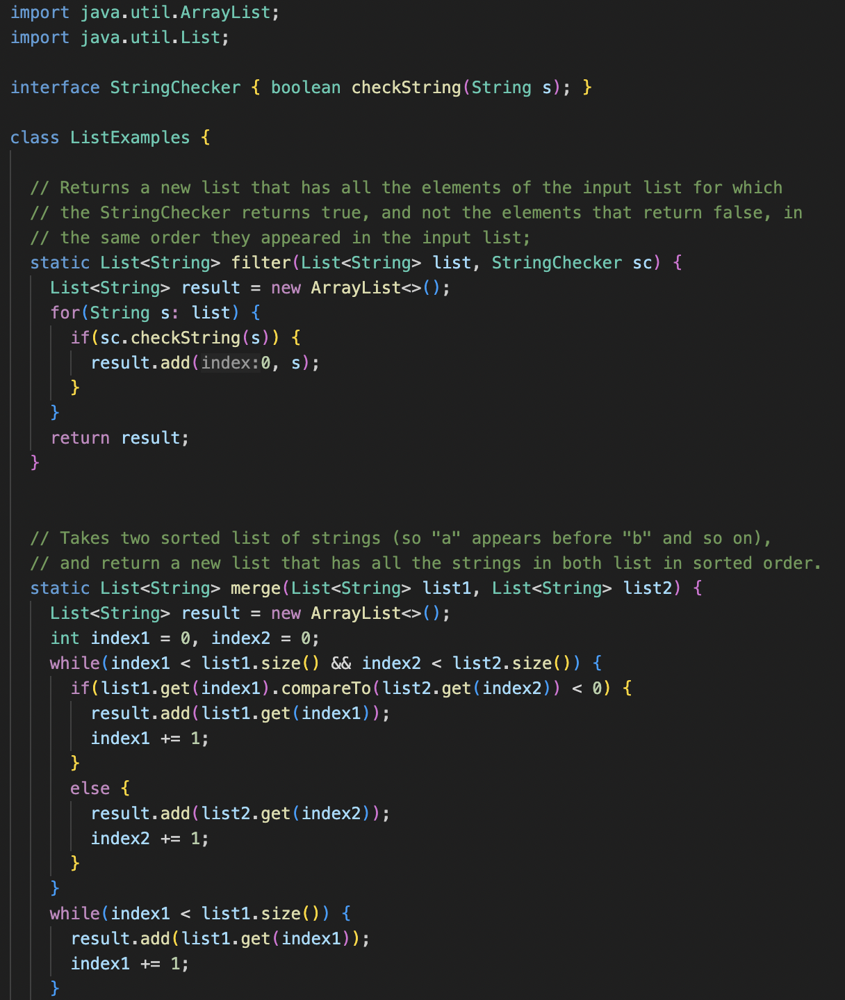
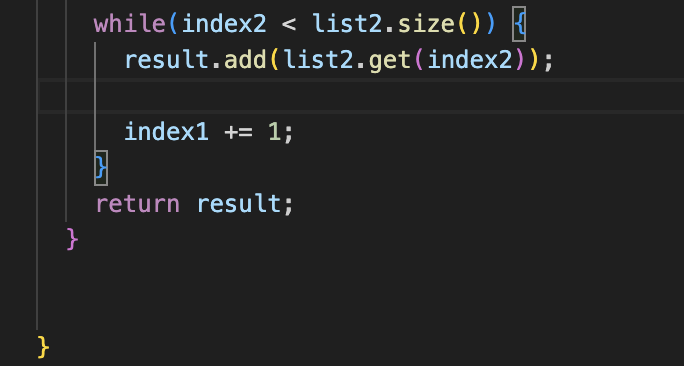
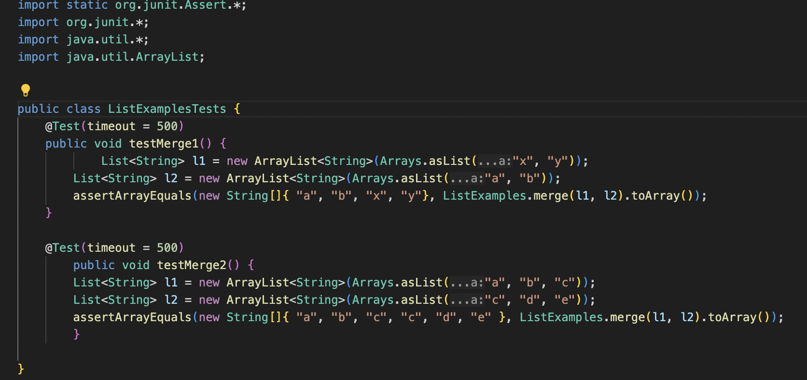
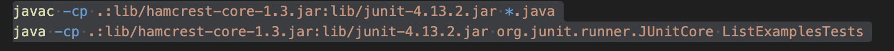

# Lab Report 5
## Part 1 - Debugging Scenario
---
---
> Student Post


- Hello, I am having trouble with my tests as I'm getting failures. I've looked back on it but I'm not sure what the problem is. I know that it's around line 42 (as shown in the failure output), but I'm not sure which part of it is wrong.
  
> TA Response
- Hi, looking at the reason the test failed, take a look at line 44. Why would this test time out?

> Student Try
-

-

- Hello, I realized my mistake! Taking your feedback, I realized I needed to change the `index1` to `index2`. Thank you.

> Setup
- The file and directory structure needed.
  
- The directory is `lab7` in this case, with `ListExamples.java`, `test.sh`, and `ListExamplesTest.java` being some of the files that are in that directory.
---
> The contents of each file before fixing the bug.
  
-
  
-
  
-
  
---
> The full command lines ran to trigger the bug.
- Failure command line
```
bash test.sh
JUnit version 4.13.2
..E
Time: 0.584
There was 1 failure:
1) testMerge2(ListExamplesTests)
org.junit.runners.model.TestTimedOutException: test timed out after 500 milliseconds
        at java.base/java.lang.System.arraycopy(Native Method)
        at java.base/java.util.Arrays.copyOf(Arrays.java:3515)
        at java.base/java.util.Arrays.copyOf(Arrays.java:3482)
        at java.base/java.util.ArrayList.grow(ArrayList.java:237)
        at java.base/java.util.ArrayList.grow(ArrayList.java:244)
        at java.base/java.util.ArrayList.add(ArrayList.java:483)
        at java.base/java.util.ArrayList.add(ArrayList.java:496)
        at ListExamples.merge(ListExamples.java:42)
        at ListExamplesTests.testMerge2(ListExamplesTests.java:19)

FAILURES!!!
Tests run: 2,  Failures: 1
```
- Success command line
```
bash test.sh
JUnit version 4.13.2
..
Time: 0.004

OK (2 tests)
```
---
> A description of what to edit to fix the bug
- The bug lied on line 44 where `index1` must be changed to `index2`. The `while` loop for `index1` was already created and `while(index2 < list2.size())` indicates the need for `index2` instead.

---
---
## Part 2 - Reflection
---
---
- Learning about vim was something new to me. I have always wanted to build a website and I found that vim can be used to do so. The shortcuts for vim, I thought was also interesting. I saw a classmate who had already know how to use vim, and he had been moving through the file very quickly. I also learned about the `find` command which made finding files a lot quicker. As someone who, admittedly, is not the most organized when it comes to my code or files, this was especially useful!
